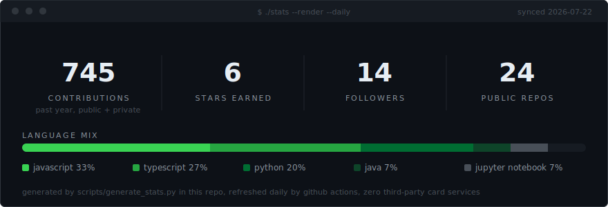

  

 

  

 

  

### <samp>$ ls ~/projects --featured</samp>

| repo | what it is | built with |
|:--|:--|:--|
| [KaalChakara](https://github.com/madhu12-c/KaalChakara) | voice-first spiritual guidance with conversational memory | `python` `js` |
| [KisanMitra-AI](https://github.com/madhu12-c/KisanMitra-AI) | matches farmers to government schemes they qualify for | `typescript` |
| [TruthCrewAi](https://github.com/madhu12-c/TruthCrewAi) | misinformation verification platform, built with my team | `python` |
| [ClearMind](https://github.com/madhu12-c/ClearMind) | journaling and burnout management for students | `javascript` |
| [FitMart](https://github.com/madhu12-c/FitMart) | full-stack store for fitness gear and nutrition | `mern` |

> the most ambitious work (ARA, client automation tools) ships from private repos. ask about it.

### <samp>$ ./tictactoe --the-internet-vs-my-bot</samp>

you can play on this board, right now, on my profile. click an empty square, press submit on the issue github opens, and a github action plays my bot's answer within a minute. refresh to see the board move.

<!-- TTT:START -->

**the internet** 0 | **my bot** 0 | draws 0

<table align="center">
  <tr>
    <td></td>
    <td></td>
    <td></td>
  </tr>
  <tr>
    <td></td>
    <td></td>
    <td></td>
  </tr>
  <tr>
    <td></td>
    <td></td>
    <td></td>
  </tr>
</table>

recent players: [@madhu12-c](https://github.com/madhu12-c)

<!-- TTT:END -->

### <samp>$ ./stats --daily</samp>

  

 

  

 

  <picture>
    <source media="(prefers-color-scheme: dark)" srcset="https://raw.githubusercontent.com/madhu12-c/madhu12-c/output/github-contribution-grid-snake-dark.svg"/>
    <source media="(prefers-color-scheme: light)" srcset="https://raw.githubusercontent.com/madhu12-c/madhu12-c/output/github-contribution-grid-snake.svg"/>
    
  </picture>

### <samp>$ ping madhu</samp>

| channel | address |
|:--|:--|
| `linkedin` | [madhusudan-chanda](https://www.linkedin.com/in/madhusudan-chanda-58807b376) |
| `email` | [mchanda2006@gmail.com](mailto:mchanda2006@gmail.com) |
| `github` | you are already here |

 

  <samp>$ exit</samp> &nbsp; every panel above is hand-written svg, and the stats redraw themselves daily from a python script in this repo. view source, take ideas.

